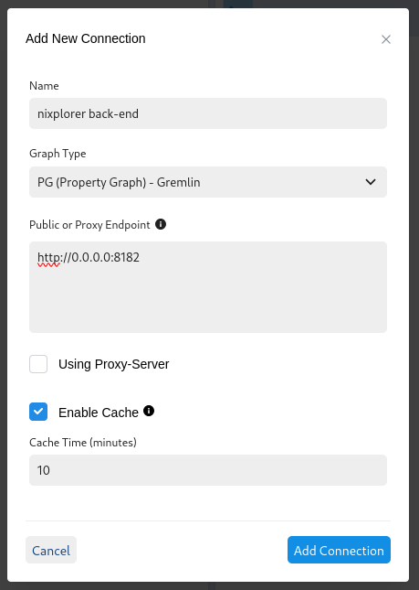

# nixplorer

A tool for visualizing Nix dependency graphs produced by [`nixtract`](https://www.github.com/tweag/nixtract).

> This tool is still in a prototype stage and is subject to bugs and major changes. Please report any issues you encounter :smile:.

## Installation / Dependencies

This project is packaged with Nix. You will need Nix installed and the Nix flakes
feature enabled to run `nixplorer`. One good option for doing this is the Nix installer
available here: https://github.com/DeterminateSystems/nix-installer.

## Usage

### 1. Generate a dependency graph with nixtract

First, install and run nixtract for the target of choice. This can generally be
done either via pip or Nix.

With pip:

```sh
# Assumes that you already have Python installed
pip install nixtract
nixtract --target-attribute-path python3Packages.jedi example-graph.jsonl
```

Or via the Nix flake:

```sh
nix run github:tweag/nixtract -- --target-attribute-path python3Packages.jedi example-graph.jsonl
```

### 2. Run nixplorer

Once you have an input graph JSONL file you are ready to run nixplorer. You can
do so using the project's Nix flake. For example:

```sh
nix run .#nixplorer -- --graph ./example-graph.jsonl
```

nixplorer will prepare the graph and launch its front-end in a browser window. You can also
navigate to the application in the browser yourself at http://0.0.0.0:8080.

#### 2.1 Configure the UI

The first time you load the ui, you will need to configure a connection for the nixplorer back-end
which is running at http://0.0.0.0:8182.



### UI features

We currently leverage AWS's graph-explorer for the nixplorer UI. You can find
further documentation on how to use graph-explorer at it's homepage here:
https://github.com/aws/graph-explorer.
